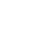

# Drone Implementation for "Quad Tok"

This project replaces the bird character in the original "Fly By" game with a DJI FPV drone model. The implementation includes custom animations, drone-specific movement physics, and updated UI elements.

## Implementation Files

1. **assets/drone/scene.gltf** - The 3D drone model (DJI FPV drone)
2. **assets/drone/drone-animations.js** - Custom animation scripts for the drone
3. **assets/icons/drone-camera.svg** - SVG icon for the drone camera view
4. **drone-implementation-updated.js** - Code snippets to integrate the drone into the game

## Implementation Steps

### 1. Replace the Bird Model with the Drone

Update the `setCharacter` function in `index.js` with the code from `drone-implementation-updated.js`. This will:
- Load the drone model instead of the bird
- Set up proper scaling and positioning
- Initialize the drone animations

```javascript
const setCharacter = async () => {
  // Load drone model instead of bird
  const model = await gltfLoader.loadAsync('assets/drone/scene.gltf');
  
  // Find a suitable mesh for collision detection
  let geo = null;
  model.scene.traverse((object) => {
    if (object.isMesh && !geo && object.geometry) {
      geo = object.geometry.clone();
    }
  });
  
  if (!geo) {
    console.error("Could not find a suitable geometry for collision detection");
    return;
  }
  
  character = model.scene;

  // Position and scale the drone appropriately
  character.position.set(0, 25, 0);
  character.scale.set(0.5, 0.5, 0.5); // Adjust these values as needed
  character.rotation.y = Math.PI; // Adjust if the drone is not facing forward
  
  // Set up drone-specific properties
  charPosYIncrement = 0;
  charRotateYIncrement = 0;
  charRotateYMax = 0.01;
  
  // Import the drone animation modules
  const animations = await import('./assets/drone/drone-animations.js');
  
  // Initialize drone animations
  propellerAnimation = animations.setupPropellerAnimation(character);
  droneTilt = animations.setupDroneTilt(character);
  hoverEffect = animations.setupHoverEffect(character, {
    amplitude: 0.05,
    frequency: 0.003
  });
  
  // Start animations
  propellerAnimation.start();
  hoverEffect.start();
  
  // Add collision detection
  geo.computeBoundsTree();
  scene.add(character);

  return;
};
```

### 2. Update the Bird's Eye View Function

Replace the `toggleBirdsEyeView` function with `toggleDroneCameraView`:

```javascript
const toggleDroneCameraView = () => {
  if(flyingIn) return;
  
  thirdPerson = !thirdPerson;
  
  if(!thirdPerson) {
    // First-person drone camera view
    camY = 3;
    camZ = 7;
  } else {
    // Return to third-person view
    camY = 160;
    camZ = -190;
  }
};
```

### 3. Update Movement Controls

Modify the `determineMovement` function to use drone-specific movement:

```javascript
// See the full implementation in drone-implementation-updated.js
```

### 4. Update UI Elements

1. Replace the bird's eye view icon with the drone camera icon:

```html
<div class="hex-container hex-birds-eye">
  
  <div class="hex hex-one"></div>
  <div class="hex hex-two"></div>
</div>
```

2. Update the event listeners:

```javascript
document.querySelector('.hex-birds-eye')
  .addEventListener('click', () => toggleDroneCameraView());
```

### 5. Add Global Variables

Add these variables to your global variables section:

```javascript
let propellerAnimation;
let droneTilt;
let hoverEffect;
```

### 6. Remove Bird-Specific Code

You can remove or comment out:
- `setCharAnimation` function (if it's only used for the bird)
- Any bird-specific animation code
- References to `charNeck` and `charBody` (the drone doesn't have these)

## Adjusting the Implementation

You may need to fine-tune these values:

1. **Drone Scale**: Adjust `character.scale.set(0.5, 0.5, 0.5)` to make the drone appear at the right size
2. **Drone Rotation**: Adjust `character.rotation.y = Math.PI` to make the drone face the right direction
3. **Camera Position**: Adjust the values in `toggleDroneCameraView()` for the best first-person view
4. **Animation Parameters**: Adjust the values in `setupHoverEffect()` for realistic hovering

## Credits

The DJI FPV drone model is based on "Dji FPV by SDC - High performance drone" (https://sketchfab.com/3d-models/dji-fpv-by-sdc-high-performance-drone-d471ea8c6235457b8e131842e2cf3783) by SDC PERFORMANCE™️ (https://sketchfab.com/3Duae) licensed under CC-BY-4.0 (http://creativecommons.org/licenses/by/4.0/) 